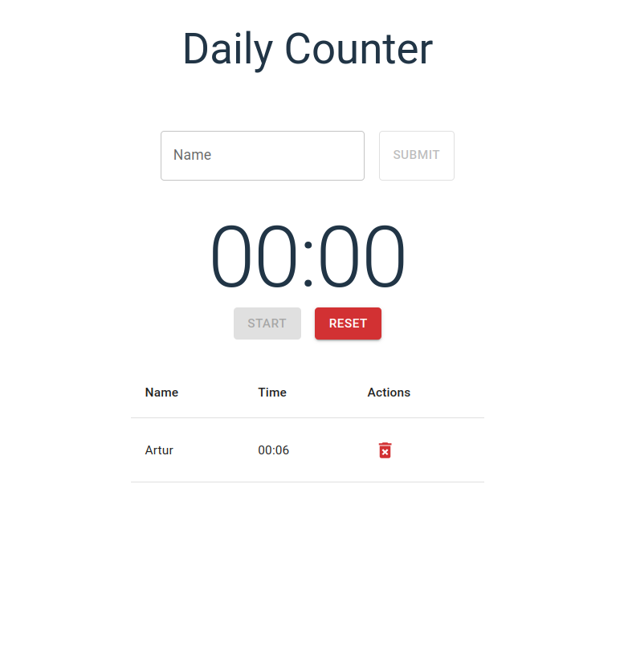

# Daily Counter

Use this app to count the reporting time of each member of your team


<br></br>

Clone the project and access its folder.

```bash
$ git clone https://github.com/arturbp/daily-counter
$ cd daily-counter
```

To start it, follow the steps below:
```bash
# Install dependencies
$ npm install

# Start the project
$ npm run dev
```